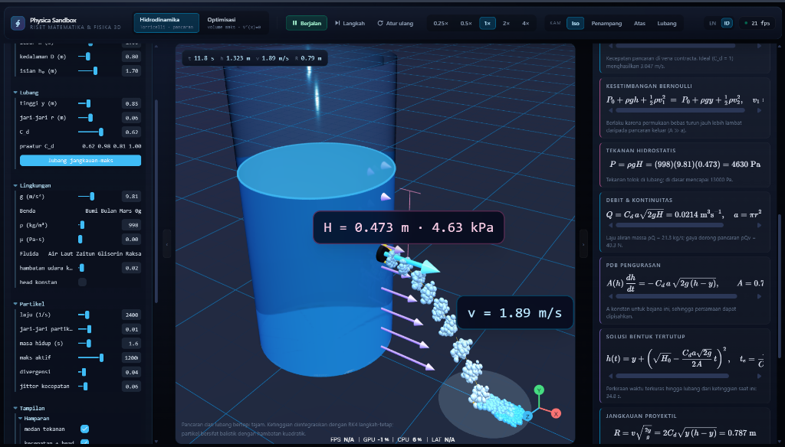
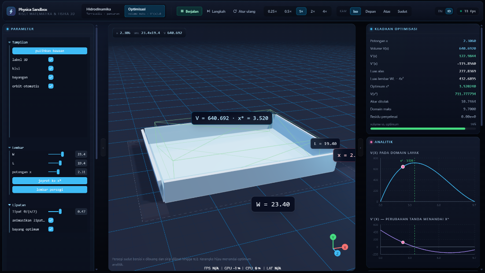
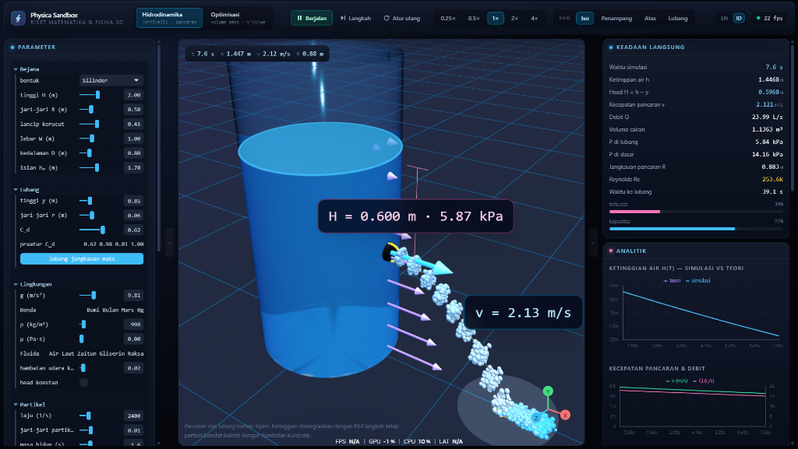

# Physica Sandbox

🌐 **Live Demo**: [https://physica-sandbox-hazel.vercel.app/](https://physica-sandbox-hazel.vercel.app/)

An interactive 3D research and teaching sandbox for two classical problems:

1. **Hydrodynamics** — efflux from a vessel through an orifice (Torricelli's law), with a
   live particle jet, hydrostatic pressure field, and the drain curve plotted against its
   closed-form solution.
2. **Calculus optimisation** — the open-box problem: cut squares of side `x` from the corners
   of a `W × L` sheet, fold, and maximise `V(x) = (W − 2x)(L − 2x)x`. The 3D mesh morphs and
   folds live while a marker tracks the slider along the `V(x)` and `V′(x)` curves.

Everything on screen is driven by the same numbers the integrator uses — the LaTeX panel
substitutes current parameter values into each law, so the equations are a read-out of the
simulation rather than a static formula sheet.

---

## Screenshots

| Hydrodynamics Simulation | Calculus Optimization |
| :---: | :---: |
|  |  |

| Analytics & Real-Time Telemetry |
| :---: |
|  |

---

## Quick start

```bash
npm install
```

```bash
npm run dev
```

| Script | What it does |
| --- | --- |
| `npm run dev` | Vite dev server on <http://localhost:5173> |
| `npm run build` | Type-check the whole repo, then produce a production bundle |
| `npm run preview` | Serve the production build |
| `npm run typecheck` | `tsc -b` across app + scripts |
| `npm run verify` | Run the 108-assertion numerical self-check (see below) |

---

## Controls

| Key | Action |
| --- | --- |
| `Space` | play / pause |
| `→` | advance exactly one 1/60 s frame |
| `R` | restart the run |
| `1` / `2` | switch module |
| `I` / `F` / `T` | isometric / front / top camera |

Drag to orbit, scroll to zoom, right-drag to pan. Camera presets fly smoothly and cancel the
moment you touch the mouse. Both side panels collapse for full-width demonstrations.

Time scale runs 0.25× – 4×. Step works while paused and advances a fixed 1/60 s of *simulated*
time, so stepping is reproducible regardless of frame rate.

### Language (English · Bahasa Indonesia)

The whole UI is bilingual. The **EN / ID** toggle in the toolbar switches every label live —
toolbar, control panel, stat read-outs, chart titles and legends, and the equation panel
(including the substituted explanatory notes). Mathematical notation and SI units (`v`, `H`,
`C_d`, `ρ`, `x*`, `m/s`, `Pa`) stay identical in both languages, since they are universal.

The choice persists to `localStorage` and also drives `<html lang>` for assistive tech. Adding a
third language is one object literal — see below.

---

## Architecture

```
src/
├─ physics/                 pure, framework-free, unit-tested
│  ├─ fluidEngine.ts        Torricelli, Bernoulli, drain ODE, RK4, closed form, kinematics
│  ├─ calculusEngine.ts     V(x), derivatives, three independent optimisers
│  ├─ foldGeometry.ts       hinge algebra for the folding sheet
│  ├─ particlePool.ts       allocation-free Lagrangian parcel buffer
│  └─ constants.ts          gravity fields, fluid presets, C_d hints
├─ i18n/
│  ├─ strings.ts            EN + ID dictionaries; `en` is the typed source of truth
│  └─ index.ts              translate() (imperative, for Leva) + useT() (reactive)
├─ state/
│  ├─ simulationStore.ts    zustand — parameters (changes at human speed)
│  ├─ telemetryStore.ts     zustand — derived read-outs, published at 12 Hz
│  └─ runtime.ts            plain mutable object — per-frame state, never touches React
├─ components/3d/
│  ├─ SimulationDriver.tsx  the single owner of time; renders nothing
│  ├─ WaterVessel.tsx       glass shell, liquid body, orifice
│  ├─ ParticleJet.tsx       InstancedMesh jet, one draw call
│  ├─ VectorArrows.tsx      pressure field, velocity vector, head, trajectory
│  ├─ FoldingBox.tsx        calculus scene
│  ├─ CameraRig.tsx         orbit controls + animated presets
│  ├─ Stage.tsx             lighting, ground, grid, contact shadows
│  └─ Viewport.tsx          the Canvas
├─ components/ui/           ControlPanel (Leva), MathOverlay (KaTeX),
│                           AnalyticsGraph (Recharts), StatsPanel, Toolbar
└─ App.tsx                  layout, keyboard transport
```

### The three-layer state split

This is the load-bearing design decision:

- **`simulationStore`** holds what the user edits. It changes at human speed, so React
  re-renders here are cheap and welcome.
- **`runtime`** holds what the integrator writes — water height, elapsed time, parcel buffers.
  It is a plain mutable object. Writing it 120×/s must never touch React.
- **`telemetryStore`** is the bridge: the driver publishes derived numbers into it at 12 Hz.
  Panels, charts and equations subscribe there, so a 120 fps viewport still causes only twelve
  React commits per second.

`SimulationDriver` is the only component allowed to advance time. Everything else reads
`runtime` inside `useFrame` and writes straight to Three.js objects.

### Adding a language

`en` in `src/i18n/strings.ts` is the source of truth: its keys define the `StringKey` union, and
every other locale is typed `Record<StringKey, string>`, so a missing or misspelled key is a
compile error, never a silent English fallback. Interpolate runtime values with `{name}`
placeholders. Leva is the only tricky consumer — it caches labels at build time, so a locale
change bumps `syncToken`, which remounts the headless control components and re-reads the
translated labels.

---

## The physics

### Efflux

Bernoulli between the free surface and the orifice of an open vessel, with `A_vessel ≫ a_orifice`
so the surface is quasi-static:

```
v_ideal = √(2gH),    H = h − y
```

Real orifices lose energy and the jet contracts at the vena contracta. Both effects are folded
into a single discharge coefficient:

```
v_jet = C_d √(2gH)          Q = a·v_jet = C_d·a·√(2gH)
```

This reproduces the standard discharge equation exactly while keeping one user-facing knob.
(A stricter treatment would separate the velocity coefficient `C_v` from `C_d`; the sandbox
deliberately does not, and the equation panel shows exactly the form being used.)

### Draining

```
A(h)·dh/dt = −C_d·a·√(2g(h − y))
```

integrated with fixed-step RK4 at Δt = 1/120 s, so results are frame-rate independent. `A(h)`
is constant for cylinders and prisms — the panel then shows and plots the closed form

```
h(t) = y + (√H₀ − C_d a √(2g) / 2A · t)²      t_e = A/(C_d a) · √(2H₀/g)
```

For a conical frustum `A(h)` is quadratic in `h` and the reference curve is integrated
numerically instead, with the final step closed analytically (RK4 marching into the `√H → 0`
singularity otherwise reports the tank empty ~0.1 % early).

### The jet

Parcels are Lagrangian tracers integrated with semi-implicit (symplectic) Euler and quadratic
drag `a = −g ŷ − k|v|v`, giving terminal speed `√(g/k)`. Emission rate is proportional to the
physical discharge `Q`, so the jet visibly thins as the head drops. The overlay also draws the
analytic drag-free parabola, so the deviation caused by drag is directly visible.

The range identity `R = 2·C_d·√(y(h − y))` peaks at `y = h/2` with `R_max = C_d·h` — the
"max-range hole" button in the Orifice folder jumps straight to it.

### Optimisation

`V′(x) = 12x² − 4(W + L)x + WL = 0` gives

```
x* = [ (W + L) − √(W² − WL + L²) ] / 6
```

which collapses to the familiar `x* = a/6` for a square sheet. The engine solves the same
problem three independent ways — closed form, bisection on `V′` refined by Newton, and
derivative-free golden-section search on `V` — and the panel reports the actual residual
between them rather than asking you to trust one formula.

---

## Performance

- The jet is a single `InstancedMesh`; the parcel pool keeps live parcels densely packed via
  swap-with-last removal, so `mesh.count = pool.count` skips dead slots for free.
- The parcel buffers are typed arrays allocated once — the hot loop never allocates.
- The liquid mesh is rebuilt only when the level crosses one of 192 quantisation steps; the
  residual is absorbed by a Y scale, so a full drain costs ~192 geometry builds instead of ~3000
  while still moving pixel-smoothly.
- The folding box is built from *unit* boxes driven purely by scale and hinge matrices, so
  scrubbing the cut slider never rebuilds geometry.
- The reference curve is sized to the run (~4000 samples) rather than to a fixed Δt, because it
  is rebuilt on every tick of a geometry slider.
- The environment map is generated in-scene from `Lightformer` panels and baked once — no
  network requests, no per-frame cost.
- `gl.info.autoReset` is disabled and the counters are reset once per frame by the driver, so
  the diagnostics panel reports the *whole* frame (shadow map + contact shadows + main scene +
  gizmo) rather than whichever pass happened to render last.

---

## Verification

`npm run verify` runs 108 assertions against independent derivations, not against the engine's
own output. Highlights:

- RK4 tracks the closed-form drain to `5×10⁻¹⁰` over a full 60 s run.
- `∫Q dt` balances the volume lost from the vessel to 0.004 %.
- The frustum volume matches a 200 000-point quadrature of `∫πr(y)²dy`.
- The range identity holds at every hole height, and a 2000-point scan confirms none beats `h/2`.
- The optimiser agrees with a 4-million-point brute-force scan of `V(x)` for four sheet shapes.
- The parcel integrator reproduces the exact symplectic-Euler solution
  `y_N = y₀ − ½g·t·(t + Δt)` and the analytic terminal velocity `√(g/k)`.
- The fold hinge algebra is composed through real `Object3D` matrices and checked for symmetry,
  wall height, and the volume body meeting the rims at every fold angle.

---

## Modelling limits

Stated plainly, because this is presented as a research tool:

- The parcels are **visual tracers**, not a coupled fluid solve. The water level comes from the
  mass-balance ODE; the parcels do not feed back into it. There is no SPH, no surface tension,
  no jet breakup into droplets.
- `C_d` is applied to both the discharge and the jet speed (see above).
- The quasi-steady assumption `A ≫ a` degrades if you open the orifice very wide relative to
  the vessel; the equation panel keeps showing the assumption it is making.
- Changing gravity or fluid mid-run re-anchors the theoretical curve at the current level and
  time rather than pretending the original prediction still applies. Geometry changes restart
  the run outright.
- In the calculus module the panels are drawn with a real thickness while the model
  `V = (W − 2x)(L − 2x)x` assumes a zero-thickness sheet. The translucent body fills the cavity
  the drawn panels actually enclose, which is `t/2` shorter than `x`; every reported number uses
  the ideal model.

---

## Stack

React 19 · TypeScript 5.8 · Vite 6 · Three.js 0.176 · @react-three/fiber 9 · @react-three/drei 10
· Leva · KaTeX · Recharts · Zustand · Tailwind CSS 4

UI languages: English · Bahasa Indonesia (toggle in the toolbar).

---

## License & Commercial Licensing

### Public & Educational Use
This project is licensed under the **[PolyForm NonCommercial License 1.0.0](LICENSE)** (or CC BY-NC-SA 4.0).

* **Free for Everyone:** Proyek ini bebas digunakan, dipelajari, dimodifikasi, dan dikembangkan untuk tujuan pendidikan, riset, dan non-komersial.
* **Attribution Required:** Hak cipta tetap milik pembuat asli. **Dilarang keras mengklaim atau mengakui proyek ini sebagai karya sendiri.** Setiap turunan/modifikasi wajib mencantumkan kredit ke pembuat asli (`TanDjendra`).
* **Non-Commercial:** Dilarang memperjualbelikan kode sumber, hasil build, maupun layanan berbasis proyek ini tanpa izin tertulis.

---

### Commercial Licensing (Untuk Perusahaan / Bisnis)
Jika Anda adalah perusahaan, institusi komersial, atau pengembang yang ingin:
- Menggunakan proyek ini untuk produk berbayar / komersial,
- Menjual lisensi turunan, atau
- Mengintegrasikan proyek ini ke dalam sistem tertutup (*proprietary/closed-source*),

Anda **wajib membeli Lisensi Komersial Khusus (*Commercial License*)**. 

Silakan hubungi pembuat proyek untuk diskusi Lisensi Komersial:
- **GitHub:** [@TanDjendra](https://github.com/TanDjendra)

